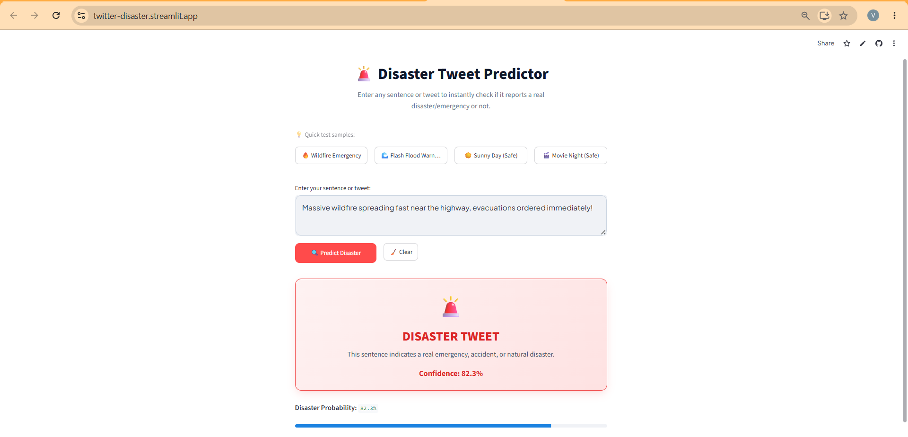

# Project_7_NHIS---Twitter-Disaster
# 🚨 Twitter Disaster Classification (NLP)

Classify whether a tweet is reporting a **real disaster** or not, using classic NLP feature engineering (TF-IDF + metadata) and classical ML models. Includes a full EDA/modeling notebook and a deployed **Streamlit** app for live predictions.

## Overview

Twitter has become a key channel for real-time disaster reporting, but not every tweet that *sounds* like a disaster actually is one (e.g. "this song is fire 🔥" vs. "wildfire spreading near the highway"). This project builds a binary text classifier that separates genuine disaster/emergency tweets from unrelated or figurative ones, so the signal can be used for faster situational awareness and emergency response.


**🔗 Live Demo:** [twitter-disaster.streamlit.app](https://twitter-disaster.streamlit.app/)

## Project Structure

```
.
├── app.py                          # Streamlit web app for live tweet predictions
├── Twitter_Disaster_NLP.ipynb      # Full EDA, feature engineering, modeling & evaluation notebook
├── requirements.txt                # Python dependencies
├── twitter_disaster.csv            # Raw labeled dataset (id, keyword, location, text, target)
├── twitter_disaster_cleaned.csv    # Cleaned/processed dataset
├── train.csv / test.csv            # Train/test splits
├── final_model.pkl                 # Trained classifier (best model from GridSearchCV)
├── final_tfidf_vectorizer.pkl      # Fitted TF-IDF vectorizer
├── final_feature_scaler.pkl        # Fitted scaler for engineered metadata features
├── Twitter Disaster.pptx           # Project presentation
├── Streamlit.png                   # Screenshot of the deployed app
└── LICENSE                         # MIT License
```

## Web App

`app.py` is a Streamlit app that loads the saved model artifacts and classifies any typed sentence or tweet as **Disaster** 🚨 or **Not a Disaster** ✅, along with a confidence score. It includes one-click example presets (wildfire, flash flood, and two safe/non-disaster samples).

👉 Try it live: **[twitter-disaster.streamlit.app](https://twitter-disaster.streamlit.app/)**



### Run locally

```bash
# 1. Clone the repo
git clone https://github.com/vm17-lab/Project_7_NHIS---Twitter_Disaster.git
cd Project_7_NHIS---Twitter_Disaster

# 2. Install dependencies
pip install -r requirements.txt

# 3. Launch the app
streamlit run app.py
```

## Tech Stack

- **Language:** Python
- **NLP:** NLTK, VADER Sentiment
- **ML:** scikit-learn (TF-IDF, Logistic Regression / Naive Bayes / Linear SVM, GridSearchCV)
- **Data:** pandas, numpy, scipy
- **App:** Streamlit
- **Notebook:** Jupyter

## Dataset

Each row contains:

| Column | Description |
|---|---|
| `id` | Unique tweet identifier |
| `keyword` | Disaster-related keyword extracted from the tweet (may be blank) |
| `location` | User-provided location (may be blank) |
| `text` | Raw tweet text |
| `target` | Label — `1` = disaster, `0` = non-disaster |

## License

This project is licensed under the [MIT License](LICENSE).
